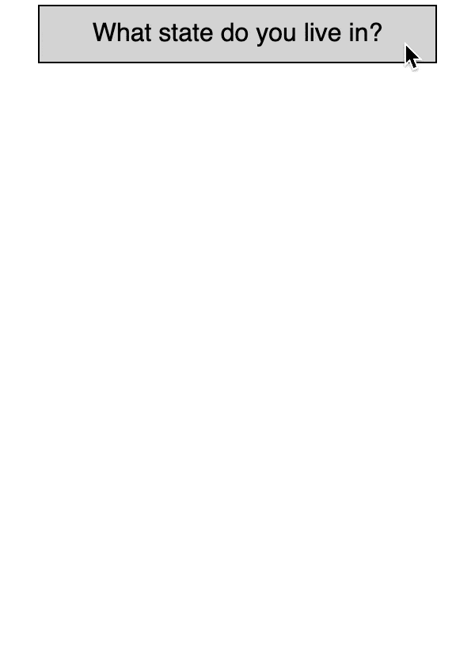

A customizable select-or-create dropdown for ReactJS



You can [view a live demo here](https://abhchand.me/demos/react-select-or-create) or [view this project on npm here](https://www.npmjs.com/package/react-select-or-create)

### Features

- Highly customizable
- Supports keyboard shortcuts
- Designed with a11y in mind
- Well tested

# Usage

Install the package:

```
yarn install react-select-or-create
```

In your React component:

```js
import ReactSelectOrCreate from 'react-select-or-create';

const countries = [
  { id: 'JP', name: 'Japan' },
  { id: 'NG', name: 'Nigeria' },
  { id: 'NL', name: 'Netherlands' }
];

<ReactSelectOrCreate items={countries} />
```

Finally, import the styling. The component ships with minimal styling that you can override as needed.

```scss
@import "react-select-or-create/dist/main.css";
```

### Specifying click behavior

The above example renders a simple dropdown, but it's probably not very useful since by default it doesn't do anything when an item is clicked or created.

We can specify this behavior with the `onSelect` and `onCreate` function handlers:

```js
import ReactSelectOrCreate from 'react-select-or-create';

const colors = [{ id: 'blue', name: 'Blue' }, { id: 'pink', name: 'Pink' }];

const onSelect = (itemId) => { alert(`Item '${itemId}' clicked!`); };

const onCreate = (itemName, prevItems) => {
  alert(`Adding '${itemName}' to the end of the list!`);

  const id = String.prototype.toLowerCase(itemName);
  return prevItems.concat[{ id: id, name: itemName }];
};

<ReactSelectOrCreate items={colors} onSelect={onSelect} onCreate={onCreate} />
```

# Props


### `items` (required)

A list of items to be displayed in the dropdown list

**type**: `{Array}`

```
[
  { id: 'JP', name: 'Apple' },
  { id: 'NG', name: 'Banana' }
]
```

All `id`s must be unique. If duplicate `id`s are detected, only the first occurance of the item is used and the remaining duplicate items will be discarded.

### `onSelect`

A function to be called when an item is selected.

**type**: `{Function(String itemId, String itemName)}`

**default**: `null`

The function will receive the id and name of the clicked item as arguments.

If no function is provided, then by default nothing will happen when an item is clicked.


### `onCreate`

A function to be called when a new item is created

**type**: `{Function(String itemName, Array prevItems)}`

**default**: `null` (see behavior below)

The function will receive the name of the new item and the list of previous items as arguments.

This function must return a **new list of items** to be displayed. It is up to you to determine how (if at all) the new item is inserted into the list of previous items, and how to generate a new unique id.

If no function is provided, then by default any newly created item will be added to the top of item list with a random `id`.

### `textForOpenMenuButton`

Text to be displayed in the "open" button

**type**: `{String | Function()}`

**default**: `'Open'`

If a `String` is provided it will be automatically wrapped in a `<span>` tag.

If a `Function` is provided, it will be called and can return any desired content, from a simple string to JSX.

### `textForCloseMenuButton`

Text to be displayed in the "close" button

**type**: `{String | Function()}`

**default**: `'Close'`

If a `String` is provided it will be automatically wrapped in a `<span>` tag.

If a `Function` is provided, it will be called and can return any desired content, from a simple string to JSX.

### `textForEmptyState`

Text to be displayed when the list of `items` is empty.

**type**: `{String}`

**default**: `'Empty'`

### `textForNoSearchResults`

Text to be displayed when no item matches the search query.

**type**: `{String}`

**default**: `'No Results'`


### `textForSearchInputPlaceholder`

Text to be displayed as the search input field `placeholder`

**type**: `{String}`

**default**: `'Search...'`


### `textForCreateItem`

Text to display in the create item section. This will be updated as the user types in the search input.

**type**: `{String | Function(String searchValue)}`

**default**: `'Create'`

If a `String` is provided it will be automatically wrapped in a `<span>` tag.

If a `Function` is provided, it will be called and can return any desired content, from a simple string to JSX. The function receives the current search string as an argument.


# Development

If you'd like to edit or develop the component locally, you can run:

```
git clone https://github.com/abhchand/react-select-or-create.git

yarn install
yarn run dev
```

This will open `http://localhost:3035` in a browser window. Any changes made to the `src/` or to the `examples/index.jsx` file will be hot reloaded.

# Issues / Contributing

- If you have an issue or feature request, please [open an issue here](https://github.com/abhchand/react-select-or-create/issues/new).

- Contribution is encouraged! But please open an issue first to suggest a new feature and confirm that it will be accepted before filing a pull request.

# Changelog

See [release notes](https://github.com/abhchand/react-select-or-create/releases)
